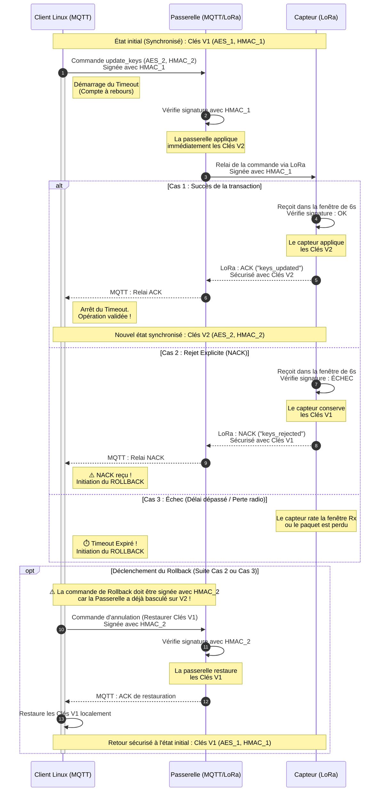

```mermaid
sequenceDiagram
    autonumber
    participant L as Client Linux (MQTT)
    participant P as Passerelle (MQTT/LoRa)
    participant C as Capteur (LoRa)

    Note over L, C: État initial (Synchronisé) : Clés V1 (AES_1, HMAC_1)

    %% Début de la mise à jour
    L->>P: Commande update_keys (AES_2, HMAC_2)<br/>Signée avec HMAC_1
    activate L
    Note right of L: Démarrage du Timeout<br/>(Compte à rebours)

    %% Traitement Passerelle
    P->>P: Vérifie signature avec HMAC_1
    Note over P: La passerelle applique<br/>immédiatement les Clés V2
    P->>C: Relai de la commande via LoRa<br/>Signée avec HMAC_1
    
    %% Embranchement (Succès vs NACK vs Timeout)
    alt Cas 1 : Succès de la transaction
        C->>C: Reçoit dans la fenêtre de 6s<br/>Vérifie signature : OK
        Note over C: Le capteur applique<br/>les Clés V2
        C-->>P: LoRa : ACK ("keys_updated")<br/>Sécurisé avec Clés V2
        P-->>L: MQTT : Relai ACK
        Note right of L: Arrêt du Timeout.<br/>Opération validée !
        Note over L, C: Nouvel état synchronisé : Clés V2 (AES_2, HMAC_2)

    else Cas 2 : Rejet Explicite (NACK)
        C->>C: Reçoit dans la fenêtre de 6s<br/>Vérifie signature : ÉCHEC
        Note over C: Le capteur conserve<br/>les Clés V1
        C-->>P: LoRa : NACK ("keys_rejected")<br/>Sécurisé avec Clés V1
        P-->>L: MQTT : Relai NACK
        Note right of L: ⚠️ NACK reçu !<br/>Initiation du ROLLBACK

    else Cas 3 : Échec (Délai dépassé / Perte radio)
        Note over C: Le capteur rate la fenêtre Rx<br/>ou le paquet est perdu
        Note right of L: ⏱️ Timeout Expiré !<br/>Initiation du ROLLBACK
    end
    
    %% Processus de Rollback (Commun aux Cas 2 et Cas 3)
    opt Déclenchement du Rollback (Suite Cas 2 ou Cas 3)
        Note over L, P: ⚠️ La commande de Rollback doit être signée avec HMAC_2<br/>car la Passerelle a déjà basculé sur V2 !
        L->>P: Commande d'annulation (Restaurer Clés V1)<br/>Signée avec HMAC_2
        
        %% Restauration
        P->>P: Vérifie signature avec HMAC_2
        Note over P: La passerelle restaure<br/>les Clés V1
        P-->>L: MQTT : ACK de restauration
        
        L->>L: Restaure les Clés V1 localement
        Note over L, C: Retour sécurisé à l'état initial : Clés V1 (AES_1, HMAC_1)
    end
    deactivate L
```